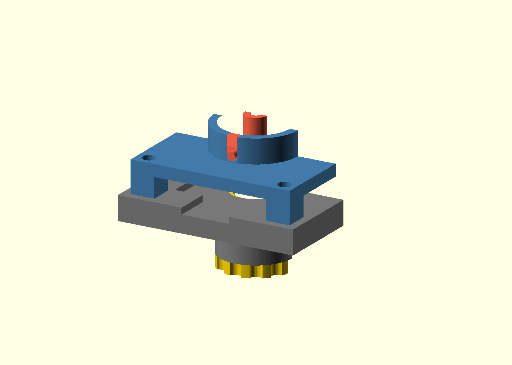

# Models

Printable parts for Alpha Stick V2. Print settings live in
[docs/PRINTING.md](../docs/PRINTING.md); the design rationale in
[docs/DESIGN_V2.md](../docs/DESIGN_V2.md).

## Pod v0: the Phase 0 bench rig

`source/pod-v0.scad` (OpenSCAD, fully parametric) generates the rig that
validates the V2 mechanism using the parts from
[docs/PHASE0_PARTS.md](../docs/PHASE0_PARTS.md). It is sized around the
**SparkFun Qwiic TMAG5273 breakout** (25.4 mm square), not the final 20 x 20 mm
pod PCB; v0 exists to produce the numbers the real pod gets sized from.



| Part | STL | What it does |
|------|-----|--------------|
| Stick hub | `stl/pod/stick-hub-v0.stl` | Printed dome pivot, D4x2 diametric magnet pocket (0.2 mm proud), anti-yaw pins, 2.6 mm carbon tube bore |
| Seat housing | `stl/pod/seat-housing-v0.stl` | PTFE-tape-lined spherical socket on a bridge over the breakout, anti-yaw slots, corner posts |
| Bench base | `stl/pod/bench-base-v0.stl` | Breakout pocket (PCB top lands flush), M12x0.75 threaded boss for the carrier, Qwiic cable reliefs |
| Adjuster carrier | `stl/pod/adjuster-carrier-v0.stl` | M12x0.75 thread, top pocket for a D10 ring magnet or M5 washer stack, grip wheel |
| Ball topper | `stl/toppers/topper-ball-v0.stl` | 8 mm ball, press-fits the carbon tube |
| Thread guide | `stl/pod/thread-guide-v0.stl` | String guide arm for the gram-scale force rig, notch near the 40 mm grip height |

### How the mechanism works in v0

The hub's printed dome (R6) rests in the housing socket lined with PTFE tape.
The sense magnet in the dome flat sits 1.5 mm above the TMAG5273 (the stack
arithmetic is derived, commented, and echoed in the .scad). The carrier rises
through the base from below; whatever sits in its pocket (ring magnet, washer
stack, or steel disc) attracts the sense magnet downward: that one attraction
is simultaneously the pivot preload and the centering force. Screwing the
carrier up or down sweeps the magnet-to-armature gap from about 4.4 to 9 mm,
which is the 1-8 gf force adjustment under test. Anti-yaw pins in collar slots
stop the hub from spinning (a diametric magnet reads yaw as direction change,
so this is required, not cosmetic). Tilt limit with default numbers: ~7 deg.

### v0 deviations from the production pod (docs/HARDWARE.md)

- Printed dome instead of a discrete steel ball; the bench compares feel and
  breakout force, and the steel-ball variant returns if PTFE-on-PETG loses.
- No steel washer on the hub; centering acts directly on the sense magnet.
- No carrier detents; printed-thread friction holds position at gram loads.
- ASSEMBLY.md describes the production pod build; for v0, assembly is: glue
  magnet in hub, tape the socket, drop hub in housing, screw housing to base
  over the breakout, thread the carrier in from below.

### Print notes

- Hub and housing at 0.12 mm; both export pre-flipped to their print
  orientation (hub neck-down so the dome prints as a smooth top surface;
  housing collar-down so the socket bowl faces up). No supports.
- The hub's anti-yaw pins print as short horizontal cantilevers; a little sag
  is fine (the slots have 0.6 mm total clearance).
- Base prints boss-down as exported, brim recommended.
- Thread binds? Adjust `thr_clr` (default 0.18) and reprint just the carrier.

### Regenerating

Edit parameters at the top of `source/pod-v0.scad`, then:

```powershell
& "C:\Program Files\OpenSCAD\openscad.com" -o models\stl\pod\stick-hub-v0.stl -D "part=`"hub`"" models\source\pod-v0.scad
```

Part selector values: `hub`, `housing`, `base`, `carrier`, `topper`, `guide`,
`plate` (all parts in print orientation), `section` (assembly cross-section).

## Community / experimental parts

Derived or third-party designs, kept separate from the core pod so their
upstream licences stay clear.

| Part | Source | What it is |
|------|--------|------------|
| Tetra II spherical flexure joint | [`community/tetra2-flexure/`](community/tetra2-flexure/) | Jelle Rommers' remote-centre spherical flexure, original `STEP` + `STL` (CC-BY). A bearing-free compliant gimbal candidate: nested tetrahedron blade flexures pivot about a point that floats ~50 mm out from the joint. See the folder README for the paper analysis. |

## Layout

```
models/
+-- source/    pod-v0.scad (parametric source of truth)
+-- stl/       ready-to-print exports (regenerate after editing source)
+-- step/      reserved for the production pod (FreeCAD/Fusion era)
+-- community/ derived / third-party parts (see table above); your toppers and bodies
```
