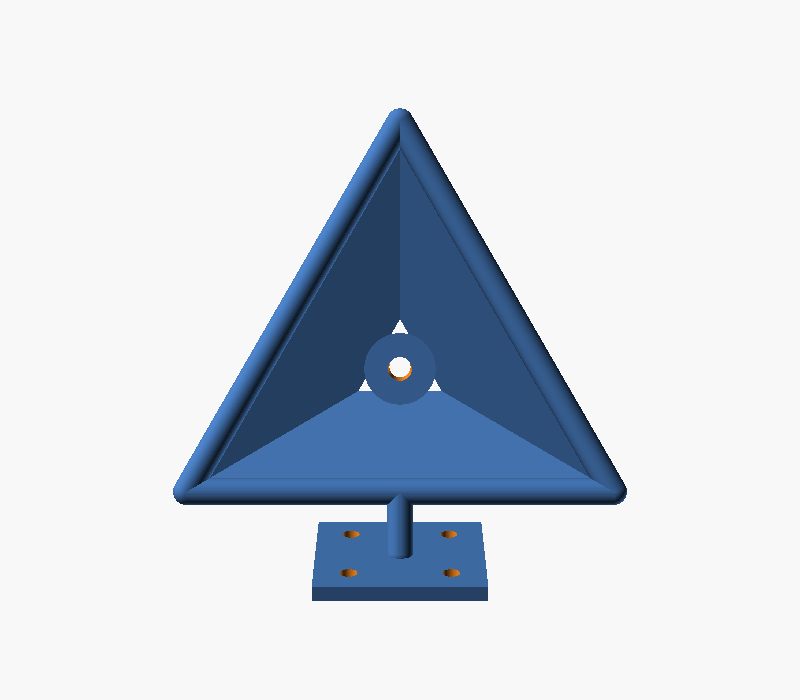
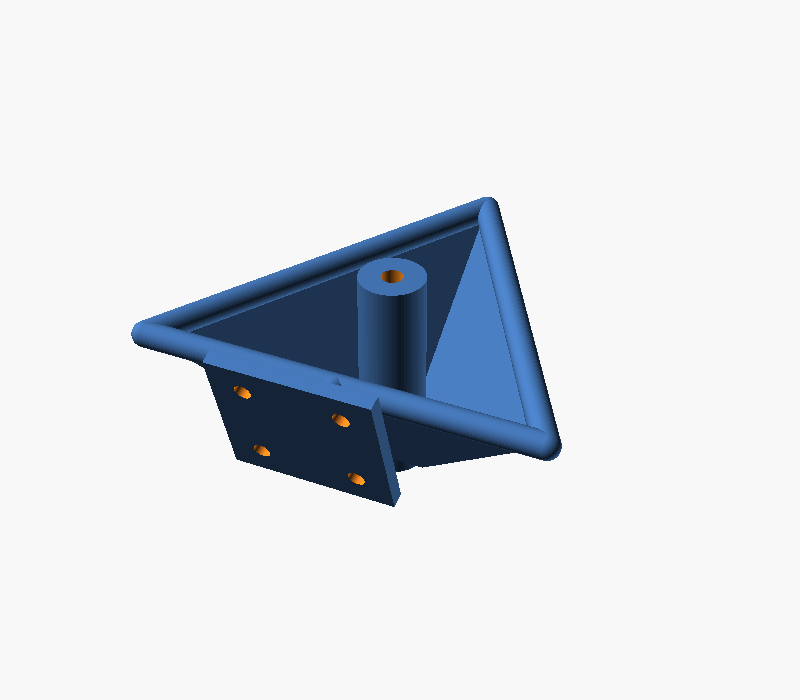
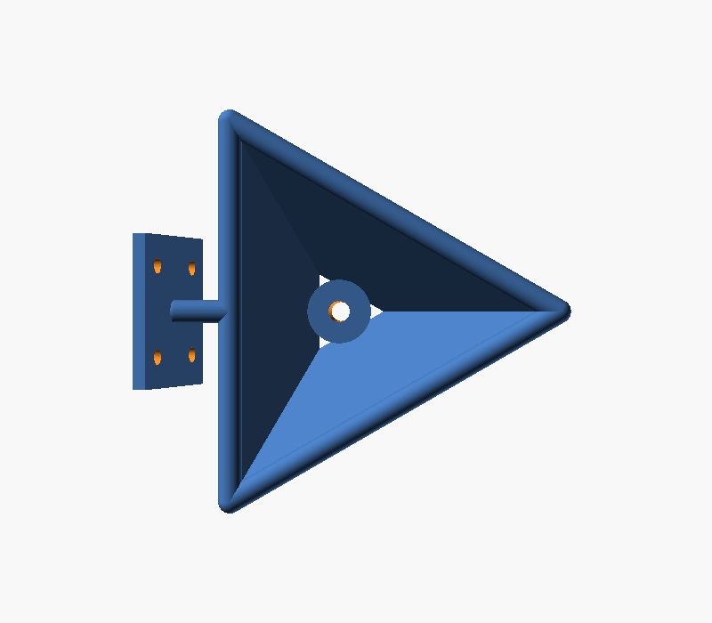

# Tetra II spherical flexure joint (parametric rebuild)

A clean, fully editable OpenSCAD re-creation of the **Tetra 2** remote-centre
spherical flexure joint. This is *not* a mesh copy of the original STL: the
geometry is generated from parameters, so you can resize it, change the wall
thickness, move the rotation point, swap the mounting foot, and export your own
STL.

It lives in `models/community/` because it is a derived third-party design, kept
separate from the core Alpha Stick pod parts. It is here as a candidate
ultra-low-force gimbal: a compliant joint has no bearings to bind and the pivot
can float out in space where a hand naturally rotates.

  

## How it works

Three thin triangular flexure blades each lie in a plane that passes through a
single point: the remote centre of rotation, sitting behind the triangular
face. Three such planes intersect at that one point, so the central hub can only
rotate about it. The result is a spherical joint whose pivot floats out in space
at `rc_distance` mm behind the face (~50 mm in the original).

## Files

| File | What it is |
|------|------------|
| `tetra2.scad` | the parametric model (edit this) |
| `tetra2.stl` | a ready-to-slice export of the default settings (manifold, verified) |
| `preview-*.png` | reference renders (front / iso / side) |

## Editing

Open `tetra2.scad` in OpenSCAD. Either tweak the values at the top of the file,
or use **Window > Customizer** for sliders grouped by section. Then press **F6**
to render and **File > Export > Export as STL**.

From the command line (run from the repo root):

```powershell
& "C:\Program Files\OpenSCAD\openscad.com" -o models\community\tetra2-flexure\tetra2.stl models\community\tetra2-flexure\tetra2.scad
```

## Key parameters

| Parameter | Effect |
|-----------|--------|
| `tri_circumradius` | overall size. Triangle side = R x sqrt(3). 64 -> ~111 mm |
| `rc_distance` | distance of the rotation point behind the face (50 = original) |
| `blade_t` | flexure blade thickness. 0.7 mm = original; print with a 0.4 mm nozzle so it lays two slightly overlapping lines |
| `blade_inner_frac` | how far the blades reach toward the pivot (0..1). Higher = longer, softer blades and a smaller inner triangle |
| `n_blades` | number of blades (3 = original). 4 also works |
| `hub_d` / `hub_bore` | output boss diameter and through-bore |
| `boss_front` | how far the boss stands proud of the face |
| `bracket`, `br_*` | the wall-mount foot (size, hole pattern, tilt). Set `bracket = false` to omit it |

## Printing notes (from the original author)

- Regular PLA is fine; no flexible filament needed.
- Thin walls of 0.7 mm worked best on a 0.4 mm nozzle.
- The original Tetra 2 rotation point sits ~50 mm from the joint surface.

## Fidelity

This is a geometric rebuild of the *principle and proportions*, not a bit-exact
clone of the SolidWorks part (impossible without the source CAD). The blade
layout, frame, hub, and foot all match; exact fillets and the foot's precise
angle are approximations you can dial in.

## Attribution / licence

Derived from **"Spherical flexure joint 1 and 2"** by **Jelle_Rommers** on
Thingiverse ([thing:4841850](https://www.thingiverse.com/thing:4841850)),
licensed **Creative Commons - Attribution (CC-BY)**. If you share or publish
this rebuild, credit Jelle Rommers and link the original:

- Thingiverse: https://www.thingiverse.com/thing:4841850
- Article: https://www.sciencedirect.com/science/article/pii/S0141635921000726
- Video: https://www.youtube.com/watch?v=DAngcygU7tc

Because this part carries a CC-BY upstream licence, it is documented here under
that licence, separate from the repo's MIT / CERN-OHL-P licensing for original
work.
