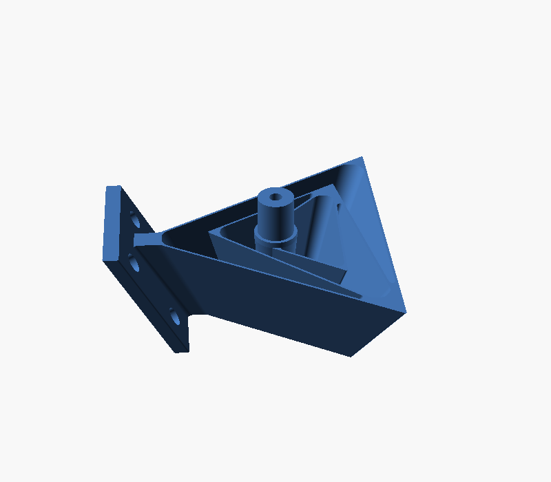
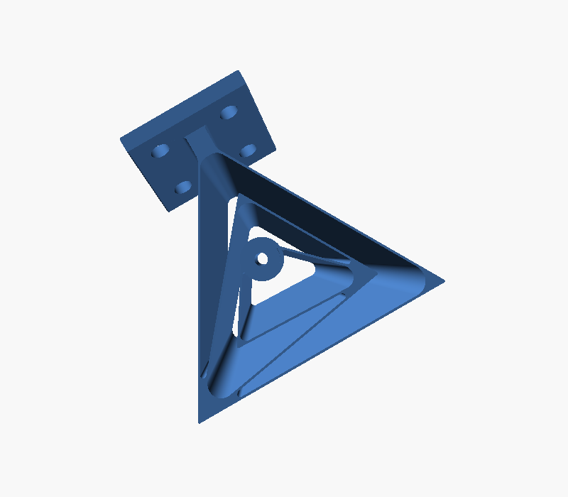

# Tetra II spherical flexure joint (original author files)

The author's original CAD for the **Tetra II** spherical flexure joint, used
directly. This is the real geometry, not a rebuild:

| File | What it is |
|------|------------|
| `Tetra2.STEP` | source CAD (B-rep). Open and edit in FreeCAD / Fusion / SolidWorks |
| `Tetra2.STL` | ready-to-slice mesh of the same part |
| `preview-*.png` | renders of the actual part (front / iso / side) |

  

This is the **primary pivot mechanism** for Alpha Stick V2: a compliant joint
has no bearings to bind, no friction, and no backlash, and the pivot floats out
in space where a hand naturally rotates. It is a third-party design and so
carries its own **CC-BY** licence (attribution below), separate from the repo's
MIT / CERN-OHL-P work; that licence travels with the part wherever it lives. The
ball-in-PTFE-cup pod is kept as the alternative mechanism (see
[docs/HARDWARE.md](../../docs/HARDWARE.md)).

> An earlier parametric OpenSCAD approximation lived here; it was a single
> tetrahedron element and did not capture the nested, variable-thickness real
> design, so it was dropped in favour of the author's STEP. It remains in git
> history (commit `8079109`) if ever wanted.

## What it is (from the paper)

Source: Rommers, van der Wijk, Herder, *"A new type of spherical flexure joint
based on tetrahedron elements"*, Precision Engineering 71 (2021) 130-140
([doi:10.1016/j.precisioneng.2021.03.002](https://doi.org/10.1016/j.precisioneng.2021.03.002),
CC-BY). It is open access; read it via the DOI above.

A spherical flexure joint is the compliant equivalent of a ball-and-socket: it
gives 3-DOF rotation about a single point **P** while constraining the three
translations. Unlike a ball joint it has no sliding surfaces, so no friction,
wear, or backlash, and it can be made in one printed piece.

Key facts that matter when reusing or editing this part:

- **Building block.** The joint is built from *tetrahedron elements*. Each
  tetrahedron element is three trapezoidal **blade flexures** (two in series,
  one in parallel) connected with no intermediate rigid bodies. The planes of
  all three blades pass through the rotation point **P**; that is what makes the
  motion purely rotational about P.
- **Tetra II specifically.** Three tetrahedron elements in a *nested* series
  configuration (Fig. 5). Two elements at an angle are enough for spherical
  motion; the third is added to raise stiffness. The three elements differ in
  both size and shape, which is why this is not cleanly parametric.
- **Remote centre.** P is a *remote* centre of rotation: it floats ~50 mm out
  from the joint face, not inside the body. Position your stick/lever so its
  natural pivot sits at P.
- **Variable blade thickness.** Real blades taper linearly from `t_max` to
  `t_min` along the element height so bending stress is spread evenly; the
  standard steel design uses `t_min = 0.5 mm`. The printed PLA version on
  Thingiverse uses ~0.7 mm walls.
- **Distributed compliance = large range of motion.** Strain is spread along
  curving blades rather than concentrated, so the joint deflects a long way
  before peak stress limits it.
- **Stiffness is the design lever, and it is hard to predict.** The paper's
  closed-form stiffness equations match FEA well for the *prism* simplification
  (NMAE 1.9%) but only qualitatively for the real *tetrahedron* element
  (NMAE 34.9%). Translation: do not trust a hand-calculated force figure for
  this part. Measure it on the bench, which is the Phase 0 approach anyway.

## For Alpha Stick

This is attractive for the ultra-low-force goal: a flexure stick has no
break-away friction, so the very first gram of input already moves it. Caveats
to validate on the bench:

- The paper's design targets steel (WEDM) or titanium (additive). **PLA** has a
  far lower modulus and poor fatigue life, so a printed version is fine for feel
  studies but will creep and fatigue under daily use. PETG or a printed-then-
  cast/metal version are follow-ups.
- The remote centre (~50 mm out) and the overall ~111 x 103 x 45 mm envelope are
  large for a handheld stick. Scaling the STEP down moves P and stiffens the
  blades non-linearly; re-measure force after any scale change.
- Single-piece print means a blade failure scraps the whole joint. Cheap to
  reprint, but worth noting for a daily-driver.

## Editing

Open `Tetra2.STEP` in FreeCAD (free), Fusion 360, or SolidWorks. The STEP is a
solid B-rep, so you can scale it, thicken blades, or cut a different stick mount,
then re-export an STL for slicing. There is no parametric feature tree in a STEP
export, so large changes are easier by re-deriving from the paper's parameters
than by editing the mesh.

Because this part is **CC BY**, any edited version you share must keep the
attribution below **and** state that you changed it (and what you changed).

## Printing notes (from the original author)

- Regular PLA is fine for a demonstrator; no flexible filament needed.
- Thin walls of ~0.7 mm work best on a 0.4 mm nozzle (two slightly overlapping
  perimeters).
- Rotation point sits ~50 mm from the joint surface.
- A second mesh on Thingiverse, `Tetra1_Requiring_supports`, is the version from
  the author's video; the Tetra2 here prints without supports.

## Attribution / licence

By **Jelle_Rommers**, Thingiverse
[thing:4841850](https://www.thingiverse.com/thing:4841850), licensed
**Creative Commons - Attribution (CC-BY)**. If you share or publish this part,
credit Jelle Rommers and link the original and the paper:

- Thingiverse: https://www.thingiverse.com/thing:4841850
- Paper: https://www.sciencedirect.com/science/article/pii/S0141635921000726
- Video: https://www.youtube.com/watch?v=DAngcygU7tc

This part carries an upstream CC-BY licence, separate from the repo's MIT /
CERN-OHL-P licensing for original work. It is also recorded repo-wide in
[NOTICE.md](../../NOTICE.md).

- **Modifications in this repo:** none — the files here are the author's original
  publication, used unmodified.
- **Licence version:** the Thingiverse listing labels it "Creative Commons -
  Attribution"; Thingiverse applies the **CC BY 3.0 Unported** generation for
  this option ([deed](https://creativecommons.org/licenses/by/3.0/)). Standalone
  text: [`LICENSE`](LICENSE) in this folder.
